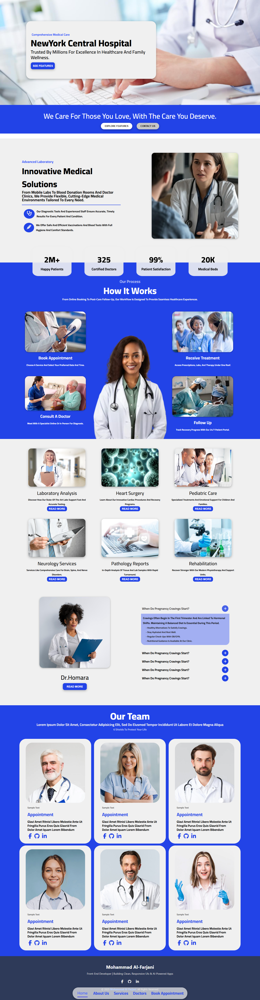

# 🏥 NewYork Central Hospital Website
A responsive and professional front-end website for a fictional hospital built with clean HTML, CSS, and JavaScript. This project is designed to simulate a real-world healthcare website, showcasing attention to detail, UI/UX design, and practical front-end architecture.

## 🖼️ Preview
Too long go down For More Things⬇️⬇️⬇️👇

## 🔗 Live Links
[Live Demo on GitHub Pages]()

---

## 📅 Project Duration
**Start Date:** June 25, 2025  
**End Date:** June 27, 2025  
**Total Time:** 3 Days

---

## 📌 Project Objective
The main goal was to create a fully functional medical website for a hospital that mirrors modern healthcare standards. It features:
- Clear and accessible layout
- Informative sections (Home, About, Services, Doctors, Blog, FAQ)
- Professional design aesthetics
- Optimized for responsiveness and readability

---

## 🛠️ Tools & Technologies Used
- HTML5
- CSS3 (Flexbox, Custom Fonts, FontAwesome)
- Vanilla JavaScript
- Google Fonts / Custom Fonts
- Fully Responsive Layout (Mobile-First Approach)

---

## 🧠 3-Day Work Plan
| Day                | Focus                     | Details                                                                                      |
|--------------------|---------------------------|----------------------------------------------------------------------------------------------|
| **Day 1** (June 25) | 🎯 Planning + HTML Structure | Set up file system, designed layout (Home, About, Services, Doctors), added semantic HTML    |
| **Day 2** (June 26) | 🎨 Styling & Responsive Design | Applied full CSS design, used FontAwesome icons, integrated custom fonts, ensured mobile responsiveness |
| **Day 3** (June 27) | ⚙️ JS + Polish               | Implemented interactivity (FAQs, menu), added image assets, improved accessibility and finished footer/socials |

---

- 🔹 GitHub Repo: [github.com/moh-alfarjani](https://github.com/moh-alfarjani)
- 🔹 Facebook Page: [facebook.com/mohalfarjani](https://www.facebook.com/mohalfarjani)
- 🔹 LinkedIn: *()*

---

## 🔖 Hashtags
`#WebDevelopment` `#FrontEndDeveloper` `#HospitalWebsite`  
`#HTML` `#CSS` `#JavaScript` `#ResponsiveDesign`  
`#HealthcareTech` `#OpenSource` `#MedicalWebsite`  
`#GitHubPortfolio` `#DeveloperProject` `#CleanCode`

---
